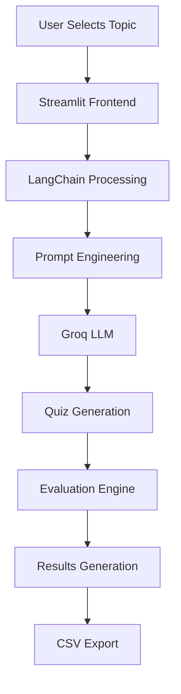
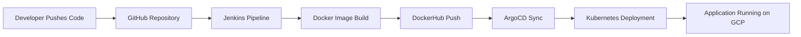

# 🚀 Study Buddy AI

<p align="center">
  
</p>

<h3 align="center">
AI-Powered Intelligent Quiz Generation Platform using LangChain, Groq, Streamlit, Docker, Jenkins, Kubernetes & GitOps
</h3>

---

<p align="center">


</p>

---

## 📌 Executive Overview

**Study Buddy AI** is an enterprise-grade AI-powered quiz generation platform designed to automate intelligent assessment creation for students, professionals, and self-learners.

The platform dynamically generates:
- Multiple Choice Questions (MCQs)
- Fill-in-the-Blank Questions
- Real-time Evaluations
- Performance Analytics

using advanced **Generative AI workflows** powered by **LangChain** and **Groq LLMs**.

The system enables users to:
- Generate quizzes dynamically from custom topics
- Select difficulty levels
- Evaluate responses instantly
- Download results as CSV reports
- Experience interactive AI-driven learning

Beyond application development, this project demonstrates strong expertise in:

- AI Engineering
- Generative AI
- LLM Orchestration
- GitOps
- MLOps
- CI/CD Automation
- Dockerization
- Kubernetes Deployment
- Cloud Infrastructure
- Scalable Deployment Pipelines

---

# ✨ Key Features

| Category | Features |
|---|---|
| 🤖 AI Features | Dynamic quiz generation using Groq LLM |
| 🧠 LLM Engineering | Prompt-based intelligent question creation |
| 📚 Quiz Types | MCQs & Fill-in-the-Blank generation |
| ⚡ Real-Time Evaluation | Instant answer validation |
| 📊 Reporting | CSV-based result export |
| 🎨 Frontend | Interactive Streamlit UI |
| 🐳 Containerization | Dockerized deployment |
| ☸️ Orchestration | Kubernetes-based deployment |
| 🔄 CI/CD | Jenkins automation pipeline |
| 🚀 GitOps | Continuous deployment using ArgoCD |
| ☁️ Cloud | GCP VM deployment |
| 🔐 Security | Environment-based secret management |
| 📈 Scalability | Modular and scalable architecture |

---

# 🏛️ System Architecture


---

# 🔄 AI Workflow



---

# ⚙️ GitOps CI/CD Workflow



---

# 🛠️ Tech Stack

## 🎨 Frontend & UI
- Streamlit (v1.57.0)

## 🤖 AI & LLM Engineering
- LangChain
- LangChain-Groq
- Prompt Engineering

## 📊 Data Handling
- Pandas

## 🐳 Containerization
- Docker

## ☸️ Orchestration
- Kubernetes
- Minikube

## 🔄 CI/CD & GitOps
- Jenkins
- ArgoCD

## ☁️ Cloud Infrastructure
- Google Cloud Platform (GCP)

## 🧩 Version Control
- GitHub

---

# 📂 Project Structure

```text
├── Architecture/                 # Architecture diagrams and workflow images
├── src/                          # Core source code
│   ├── common/                   # Shared utilities and helpers
│   ├── config/                   # Configuration management
│   ├── generator/                # Quiz generation modules
│   ├── llm/                      # Groq LLM integration logic
│   ├── models/                   # Data models and schemas
│   ├── prompts/                  # Prompt templates for AI workflows
│   └── utils/                    # Utility/helper functions
│
├── application.py                # Main Streamlit application
├── requirements.txt              # Python dependencies
├── Dockerfile                    # Docker container configuration
├── Jenkinsfile                   # CI/CD pipeline definition
├── manifests/                    # Kubernetes YAML manifests
├── FULL_DOCUMENTATION.md         # Complete infrastructure documentation
└── README.md                     # Project documentation
```

---

# 🧠 AI Engineering Workflow

## Prompt Engineering Pipeline

The application utilizes structured prompt engineering techniques to generate:
- Topic-specific quizzes
- Difficulty-aware questions
- Structured MCQ formats
- Fill-in-the-Blank assessments

## LangChain Orchestration

LangChain handles:
- Prompt management
- LLM communication
- Response parsing
- Structured output generation

## Groq LLM Integration

Groq provides:
- High-speed inference
- Low-latency generation
- Scalable LLM execution
- Efficient AI response generation

---

# 📈 Scalability & Engineering Highlights

- Modular source code architecture
- Containerized application deployment
- Kubernetes-ready infrastructure
- GitOps-driven deployment workflow
- Environment-driven configuration management
- CI/CD automation pipeline
- Cloud-ready deployment strategy
- Production-oriented engineering practices

---

# 🔐 Security Features

- API keys managed through `.env`
- Environment-based configuration isolation
- Docker runtime isolation
- Kubernetes secret management support
- CI/CD credential handling via Jenkins

---

# 🚀 Quick Start (Local Setup)

## 1️⃣ Clone Repository

```bash
git clone https://github.com/pamuarun/STUDY-BUDDY-AI.git
cd STUDY-BUDDY-AI
```

---

## 2️⃣ Create Virtual Environment

```bash
python -m venv venv
```

### Activate Environment

#### Linux/MacOS

```bash
source venv/bin/activate
```

#### Windows

```bash
venv\Scripts\activate
```

---

## 3️⃣ Install Dependencies

```bash
pip install -r requirements.txt
```

---

## 4️⃣ Configure Environment Variables

Create a `.env` file:

```env
GROQ_API_KEY=your_groq_api_key_here
```

---

## 5️⃣ Run Application

```bash
streamlit run application.py
```

---

# 🔄 CI/CD Pipeline

The project implements a complete GitOps-based CI/CD workflow.

## Jenkins Pipeline Includes

- GitHub repository integration
- Automated code checkout
- Docker image building
- DockerHub image push
- Continuous deployment automation
- Kubernetes deployment synchronization

## ArgoCD Responsibilities

- GitOps synchronization
- Kubernetes deployment automation
- Continuous deployment monitoring
- Infrastructure state management

---

# 📊 Monitoring & Observability

Current/Planned Monitoring Integrations:

- Prometheus metrics collection
- Grafana dashboards
- Kubernetes health monitoring
- Centralized logging
- CI/CD monitoring

---

# 🌍 Real-World Use Cases

- Educational assessment automation
- AI-driven learning platforms
- Adaptive quiz generation systems
- Personalized learning applications
- Intelligent educational assistants

---

# 🚀 Future Enhancements

- Multi-agent AI orchestration
- RAG-based intelligent tutoring
- Vector database integration
- Personalized adaptive learning
- User authentication & analytics
- Multi-LLM routing
- AI memory systems
- Performance analytics dashboard
- Prometheus & Grafana integration
- Cloud-native autoscaling

---

# 📖 Comprehensive Infrastructure Documentation

A detailed deployment and infrastructure guide is available in:

```text
FULL_DOCUMENTATION.md
```

The documentation covers:

- GCP VM Setup
- Docker Installation
- Kubernetes Setup
- Minikube Configuration
- Jenkins in Docker (DIND)
- DockerHub Integration
- ArgoCD Installation
- Kubernetes Secrets
- GitOps Workflow
- Application Deployment

---

# 🔗 Repository

GitHub Repository:

```bash
https://github.com/pamuarun/STUDY-BUDDY-AI.git
```

---

# 👨‍💻 Author

## Arun Teja

AI Engineer | MLOps Enthusiast | DevOps Learner | Generative AI Developer


# ❤️ Acknowledgements

Special thanks to:
- LangChain
- Groq
- Streamlit
- Kubernetes
- Jenkins
- ArgoCD
- Open Source Community

---

<p align="center">
Built with ❤️ using AI, LLMOps, Kubernetes, GitOps & Cloud Engineering
</p>