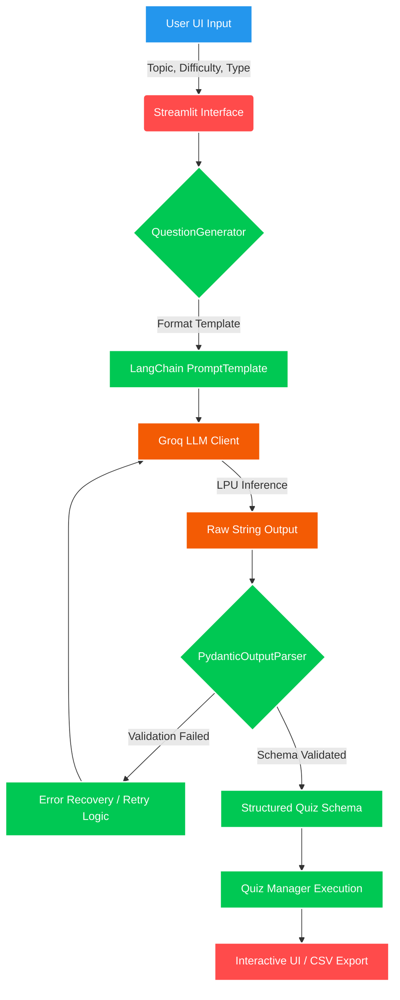

<div align="center">


<h1 align="center">Enterprise LLMOps & Generative AI Assessment Platform</h1>

<p align="center">
  <strong>Intelligent, Autonomous Quiz Generation & Orchestration Engine</strong><br>
  Built with <strong>LangChain</strong>, <strong>Groq LPUs</strong>, <strong>Streamlit</strong>, <strong>Kubernetes</strong>, and <strong>ArgoCD</strong>
</p>

<p align="center">
  <a href="https://www.python.org/"></a>
  <a href="https://python.langchain.com/"></a>
  <a href="https://groq.com/"></a>
  <a href="https://streamlit.io/"></a>
  <a href="https://www.docker.com/"></a>
  <a href="https://kubernetes.io/"></a>
  <a href="https://argo-cd.readthedocs.io/en/stable/"></a>
  <a href="https://www.jenkins.io/"></a>
</p>

<p align="center">
  
</p>


<hr>

</div>

## 📌 Executive Overview

**Study Buddy AI** is a state-of-the-art generative assessment engine engineered for high-throughput, dynamic educational content creation. It solves the critical bottleneck of manual test formulation by orchestrating complex Large Language Model (LLM) pipelines to autonomously generate, validate, and serve interactive assessments. 

Designed with an **Enterprise MLOps/LLMOps** mindset, the system is fully containerized, orchestrated via **Kubernetes**, and deployed using a strict **GitOps** paradigm. This ensures immutable infrastructure, absolute environment parity, and highly scalable inference capabilities.

**Enterprise Value Proposition:**
- ⚡ **Ultra-Low Latency Inference:** Utilizing Groq LPUs for real-time AI generation.
- 🔄 **Declarative GitOps Lifecycle:** ArgoCD ensures zero-configuration drift.
- 🛡️ **Bulletproof LLM Outputs:** Pydantic parsing guarantees structured, predictable AI payloads.

---

## 🚀 Professional Features

### 🧠 Generative AI & LLMOps Features
- **Advanced Agentic Routing:** Leverages **LangChain** to orchestrate dynamic prompt pipelines.
- **Strict Output Validation:** Utilizes `PydanticOutputParser` to enforce strict JSON schemas (`MCQQuestion`, `FillBlankQuestion`) preventing LLM hallucinations.
- **Autonomous Retry Mechanisms:** Built-in exponential backoff and error recovery for LLM inference failures (`_retry_and_parse` logic).
- **High-Speed Inference:** Integration with Groq's `llama-3.1-8b-instant` via LPUs for unparalleled token generation speed.

### ⚙️ DevOps & Cloud Infrastructure
- **GitOps Driven Deployment:** **ArgoCD** acts as the continuous deployment controller, watching the GitHub repository to automatically reconcile the state of the **Kubernetes** cluster.
- **CI/CD Automation:** Comprehensive **Jenkins** pipeline automating code checkout, Docker image builds, DockerHub registry pushes, and ArgoCD synchronization.
- **Immutable Infrastructure:** All deployment components (`deployment.yaml`, `service.yaml`) are version-controlled and applied declaratively.
- **Containerization Excellence:** Multi-stage optimized `python:3.10-slim` Dockerfiles reducing attack surface and footprint.

### 🔒 Security & Reliability Features
- **Secret Decoupling:** API keys are injected via Kubernetes `SecretKeyRef` preventing hardcoded credentials.
- **Stateless Architecture:** Designed for horizontal pod autoscaling (HPA) without session affinity constraints.
- **Robust Exception Handling:** Custom exception layers (`CustomException`) and centralized logging configurations.

---

## 🏛️ Advanced Architecture

### 1. AI Pipeline & Orchestration Workflow



### 2. Enterprise GitOps Deployment Topology

```mermaid
graph LR
    classDef repo fill:#181717,stroke:#fff,stroke-width:2px,color:#fff;
    classDef ci fill:#D24939,stroke:#fff,stroke-width:2px,color:#fff;
    classDef cd fill:#EF7B4D,stroke:#fff,stroke-width:2px,color:#fff;
    classDef k8s fill:#326CE5,stroke:#fff,stroke-width:2px,color:#fff;

    Dev[Engineer] -->|Git Push| Git[GitHub Repository]:::repo
    Git -->|Webhook| Jenkins[Jenkins CI Pipeline]:::ci
    
    subgraph Continuous Integration
    Jenkins -->|1. Build| Docker(Docker Image)
    Docker -->|2. Push| Hub[DockerHub Registry]
    end
    
    subgraph Continuous Deployment (GitOps)
    Argo[ArgoCD Controller]:::cd <-->|Polls State| Git
    Argo -->|Pulls Image| Hub
    Argo -->|Reconciles State| K8s[Kubernetes Cluster]:::k8s
    end
    
    subgraph Kubernetes Production
    K8s --> Deploy[Deployment: llmops-app]
    Deploy --> Pod1[Pod 1]
    Deploy --> Pod2[Pod 2]
    Deploy --> Secret[groq-api-secret]
    Pod1 & Pod2 --> Svc[Service: NodePort]
    end
```

---

## 🛠️ Engineering Deep Dive

### Architectural Decisions & Tradeoffs
1. **Pydantic Validation over Raw JSON:** We explicitly avoided asking the LLM to simply output JSON. Instead, LangChain's `PydanticOutputParser` injects format instructions into the prompt and validates the output strictly against `MCQQuestion` and `FillBlankQuestion` schemas. **Tradeoff:** Slightly higher token consumption for instructions, but eliminates application crashes due to malformed LLM responses.
2. **ArgoCD over Jenkins Deployments:** While Jenkins builds the Docker images, it *does not* run `kubectl apply`. ArgoCD is utilized as the source of truth, pulling the desired state from Git. This prevents configuration drift and allows for immediate rollback to previous commits.
3. **Groq LPU vs Traditional GPUs:** Selected Groq for the inference engine. Educational tools require high interactivity; Groq's Tensor Streaming Architecture provides the necessary tokens-per-second throughput to make generation feel instantaneous to the end-user.

---

## 📂 Professional Project Structure

```text
📦 STUDY-BUDDY-AI
┣ 📂 Architecture         # 📐 System design and workflow diagrams
┣ 📂 manifests            # ☸️ Kubernetes declarative configurations (GitOps)
┃ ┣ 📜 deployment.yaml    # 🚀 Application deployment (ReplicaSet, Pod specs)
┃ ┗ 📜 service.yaml       # 🌐 K8s Service definitions (NodePort exposure)
┣ 📂 src                  # 💻 Core Application & AI Logic
┃ ┣ 📂 common             # 🛠️ Shared enterprise utilities (Exceptions, Logger)
┃ ┣ 📂 config             # ⚙️ Environment variables & runtime settings
┃ ┣ 📂 generator          # 🧠 LangChain Prompt & Output Parsing orchestration
┃ ┣ 📂 llm                # 🔌 LLM Provider integrations (Groq Client wrapper)
┃ ┣ 📂 models             # 🛡️ Data validation schemas (Pydantic models)
┃ ┣ 📂 prompts            # 📝 Prompt Engineering (Few-shot, Instructions)
┃ ┗ 📂 utils              # 🧰 Application state management (QuizManager)
┣ 📜 application.py       # 🎨 Frontend orchestration (Streamlit entrypoint)
┣ 📜 Dockerfile           # 🐳 Multi-stage optimized container instructions
┣ 📜 Jenkinsfile          # 🏗️ Enterprise CI/CD Pipeline as Code
┗ 📜 requirements.txt     # 📦 Python dependency lockfile
```

---

## 🔌 API & Pipeline Documentation

### Internal Python API Interface
The system is built on a highly modular Python API, allowing seamless extraction of the backend for future microservice (FastAPI/Flask) deployments.

| Component | Method | Payload / Arguments | Response Schema |
|-----------|--------|---------------------|-----------------|
| **LLM Client** | `get_groq_llm()` | `api_key`, `model`, `temperature` | `ChatGroq` Instance |
| **Generator** | `generate_mcq()` | `topic: str`, `difficulty: str` | `MCQQuestion` (Pydantic) |
| **Generator** | `generate_fill_blank()` | `topic: str`, `difficulty: str` | `FillBlankQuestion` (Pydantic) |

### Strict Pydantic Data Models
```python
class MCQQuestion(BaseModel):
    question: str
    options: List[str] # Validated to strictly contain 4 elements
    correct_answer: str # Validated to exist within the options array
```

---

## 🔐 Security & Observability

### Security Posture
- **API Key Abstraction:** Keys are managed entirely outside the codebase using Kubernetes Secrets (`groq-api-secret`) mapped to environment variables inside the Pods.
- **Container Isolation:** The application runs inside an isolated Docker container, adhering to the principle of least privilege. 

### Observability Setup
- **Application Logging:** Python's standard `logging` library is implemented via a central `logger.py` utility, ensuring all LLM invocations, parser failures, and system states are piped to `stdout` for collection by aggregation tools (e.g., Fluentd, ELK, or Loki).
- **Pipeline Monitoring:** Jenkins captures real-time build telemetry and ArgoCD provides a visual dashboard for Kubernetes resource health, synchronization status, and drift detection.

---

## 🛳️ Deployment Guide

### 1. Local Containerized Deployment

```bash
# 1. Clone the repository
git clone https://github.com/pamuarun/STUDY-BUDDY-AI.git
cd STUDY-BUDDY-AI

# 2. Build the Docker Image
docker build -t studybuddy:local .

# 3. Run the container with environment variables
docker run -p 8501:8501 -e GROQ_API_KEY="your_api_key" studybuddy:local
```

### 2. Production Kubernetes & GitOps Deployment

This repository is built for production environments via Google Cloud Platform (GCP) and Minikube/GKE. 

1. **Secret Provisioning:**
   ```bash
   kubectl create secret generic groq-api-secret \
     --from-literal=GROQ_API_KEY="your-groq-key" \
     -n default
   ```
2. **Apply Manifests (Manual Trigger):**
   ```bash
   kubectl apply -f manifests/deployment.yaml
   kubectl apply -f manifests/service.yaml
   ```
3. **GitOps Trigger (Automated):**
   Simply commit changes to the `main` branch. The Jenkins pipeline will build and push the new Docker image, and ArgoCD will automatically detect the new image tag/manifests and reconcile the cluster.

> **💡 Detailed Infrastructure Setup:** For comprehensive instructions on standing up the VM, Minikube, Jenkins DIND, and ArgoCD, refer to the exhaustive [**FULL_DOCUMENTATION.md**](FULL_DOCUMENTATION.md) included in this repository.

---

## 📸 Enterprise Dashboards (Placeholders)

<div align="center">
  <table>
    <tr>
      <td align="center"><b>ArgoCD Synchronization Dashboard</b></td>
      <td align="center"><b>Streamlit Interactive UI</b></td>
    </tr>
    <tr>
      <td></td>
      <td></td>
    </tr>
    <tr>
      <td align="center"><b>Jenkins CI/CD Pipeline</b></td>
      <td align="center"><b>Kubernetes Cluster Health</b></td>
    </tr>
    <tr>
      <td></td>
      <td></td>
    </tr>
  </table>
</div>

---

<div align="center">
  <p>Engineered with ❤️ for seamless learning and AI architecture.</p>
  <a href="https://github.com/pamuarun/STUDY-BUDDY-AI.git"><strong>Return to Repository</strong></a>
</div>
